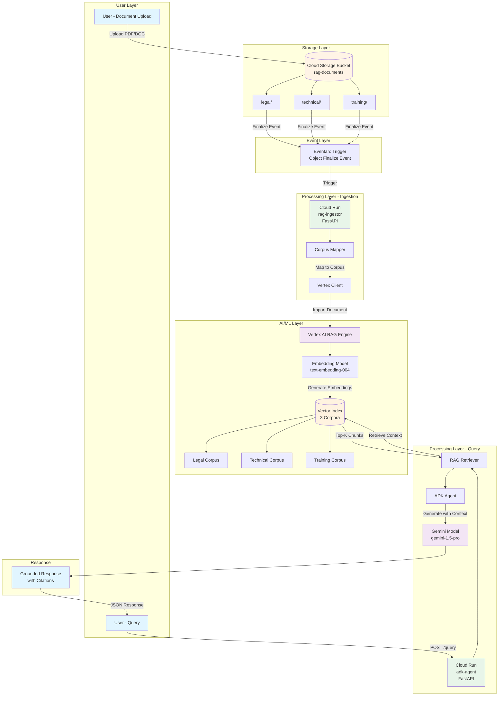
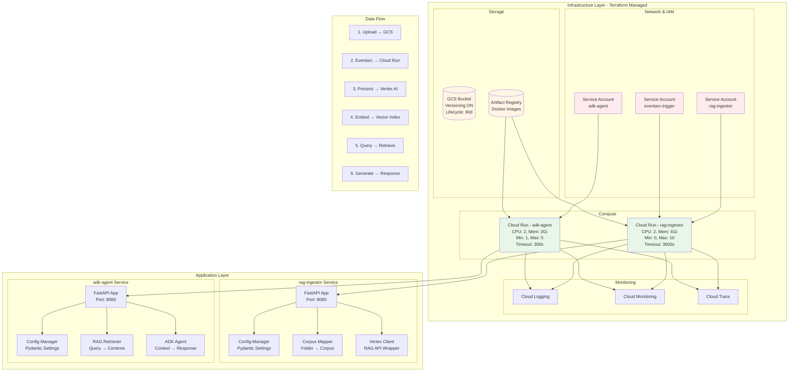
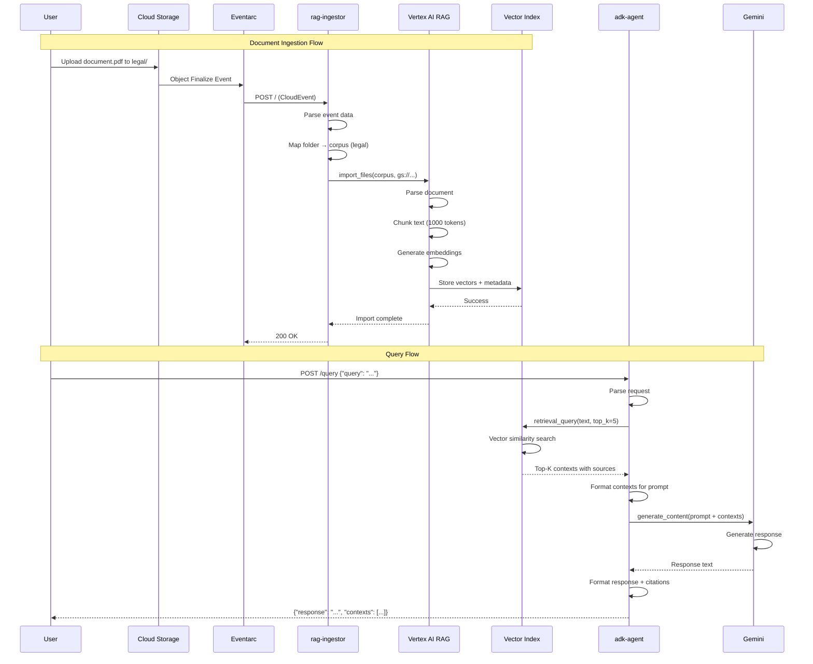
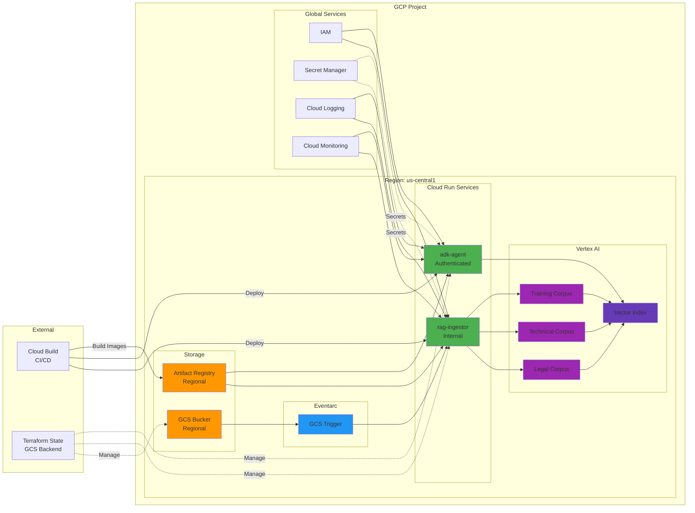
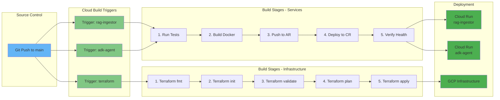
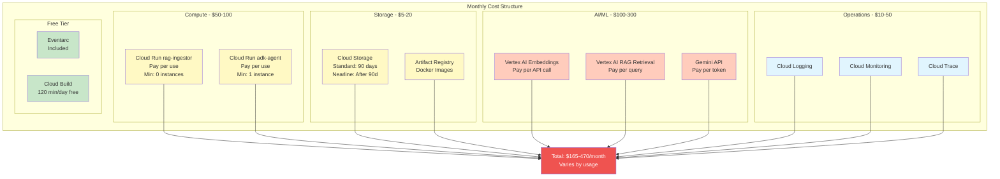
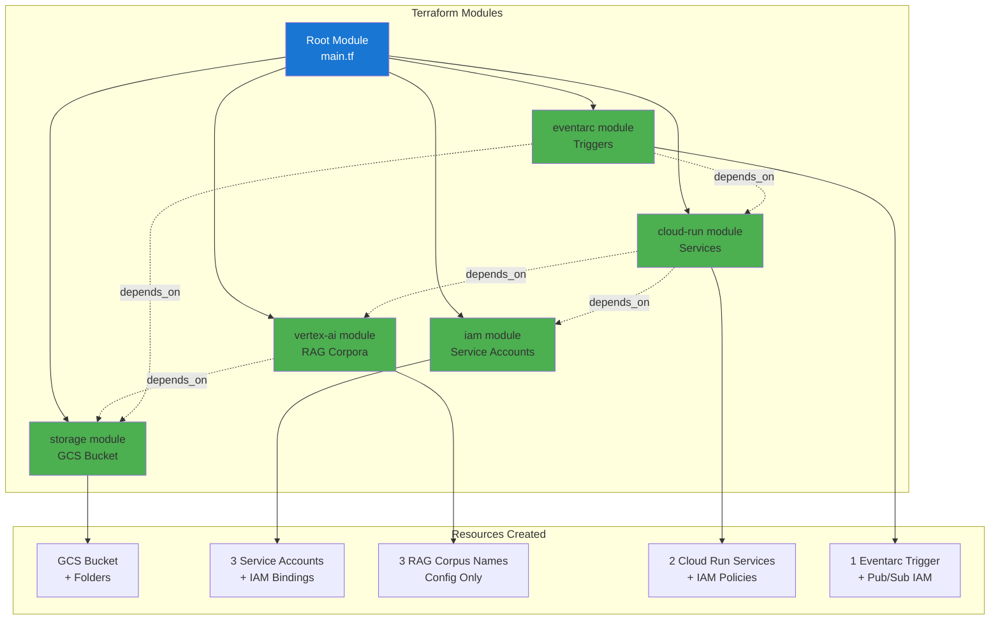

# Super_RAG V1 - Architecture Diagrams

## 1. High-Level System Architecture



## 2. Detailed Component Architecture



## 3. Data Flow Sequence Diagram



## 4. Infrastructure Topology



## 5. Security & IAM Architecture

```mermaid
graph TB
    subgraph "Service Accounts"
        SA1[rag-ingestor@<br/>project.iam.gserviceaccount.com]
        SA2[adk-agent@<br/>project.iam.gserviceaccount.com]
        SA3[eventarc-trigger@<br/>project.iam.gserviceaccount.com]
        SA4[cloudbuild@<br/>project.iam.gserviceaccount.com]
    end

    subgraph "IAM Roles"
        R1[roles/aiplatform.user]
        R2[roles/storage.objectViewer]
        R3[roles/logging.logWriter]
        R4[roles/eventarc.eventReceiver]
        R5[roles/run.invoker]
        R6[roles/run.admin]
    end

    subgraph "Resources"
        GCS[(Cloud Storage)]
        VAI[Vertex AI]
        CRI[rag-ingestor<br/>Cloud Run]
        CRA[adk-agent<br/>Cloud Run]
        LOG[Cloud Logging]
    end

    SA1 --> R1
    SA1 --> R2
    SA1 --> R3

    SA2 --> R1
    SA2 --> R3

    SA3 --> R4
    SA3 --> R5

    SA4 --> R6
    SA4 --> R5

    R1 --> VAI
    R2 --> GCS
    R3 --> LOG
    R5 --> CRI
    R5 --> CRA
    R6 --> CRI
    R6 --> CRA

    style SA1 fill:#ffcdd2
    style SA2 fill:#ffcdd2
    style SA3 fill:#ffcdd2
    style SA4 fill:#ffcdd2
    style R1 fill:#c8e6c9
    style R2 fill:#c8e6c9
    style R3 fill:#c8e6c9
    style R4 fill:#c8e6c9
    style R5 fill:#c8e6c9
    style R6 fill:#c8e6c9
```

## 6. CI/CD Pipeline Flow



## 7. Cost Breakdown Architecture



## 8. Terraform Module Dependencies



## Architecture Key Points

### Scalability
- **Cloud Run**: Auto-scales from 0 to 10 instances for ingestor
- **Vertex AI**: Managed vector index handles large-scale retrieval
- **Eventarc**: Handles high-volume file uploads asynchronously

### Reliability
- **Retry Logic**: Tenacity library with exponential backoff
- **Health Checks**: Liveness and startup probes on Cloud Run
- **State Management**: Terraform remote state with locking

### Security
- **Least Privilege**: Each service has minimal IAM permissions
- **Authentication**: IAM-based auth for all Cloud Run services
- **Secrets**: Secret Manager for sensitive configuration
- **Network**: Uniform bucket-level access, internal-only ingress

### Observability
- **Logging**: Structured JSON logs to Cloud Logging
- **Monitoring**: Metrics exported to Cloud Monitoring
- **Tracing**: Cloud Trace for request tracking
- **Alerting**: Budget alerts and error rate monitoring

### Cost Optimization
- **Scale to Zero**: rag-ingestor min instances = 0
- **Lifecycle Policies**: Move old data to Nearline storage
- **Batch Processing**: Chunk documents efficiently
- **Budget Alerts**: Set at $500/month with 50%, 80%, 100% notifications
